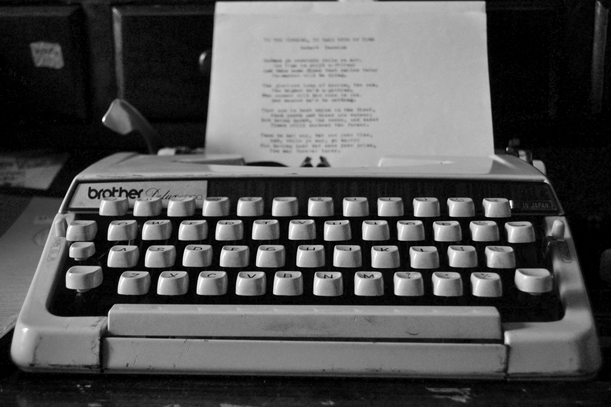

---
# You can also start simply with 'default'
theme: seriph
background: /images/margarida-afonso-ahMCpXdUjv0-unsplash.jpg
# some information about your slides (markdown enabled)
title: Software as Craft(ing)
info: |
  ## Software as Craft(ing)
  A talk about writing software as a craft project.

# apply unocss classes to the current slide
class: text-center
# https://sli.dev/features/drawing
drawings:
  persist: false
# slide transition: https://sli.dev/guide/animations.html#slide-transitions
transition: slide-left
# enable MDC Syntax: https://sli.dev/features/mdc
mdc: true
# open graph
# seoMeta:
#  ogImage: https://cover.sli.dev
---

# Software as Craft(ing)

<div class="absolute bottom-4 right-4 text-xs">
Photo by <a href="https://unsplash.com/@mrafonso1976?utm_content=creditCopyText&utm_medium=referral&utm_source=unsplash">Margarida Afonso</a> on <a href="https://unsplash.com/photos/orange-blue-and-white-yarn-ahMCpXdUjv0?utm_content=creditCopyText&utm_medium=referral&utm_source=unsplash">Unsplash</a>
</div>
---

<div class="relative w-full h-96">
  <!-- Painting - starts large, shrinks to top-left corner -->
  <div
    v-motion
    :initial="{ scale: 1, x: 0, y: 0, opacity: 1 }"
    :click-1="{ scale: 0.3, x: -300, y: -200, opacity: 0.8, transition: { duration: 800, ease: 'easeInOut' } }"
    class="absolute inset-0 w-full h-full"
  >
    <div class="absolute inset-0 flex items-center justify-center z-10">
      <div class="text-2xl font-bold pb-8 drop-shadow-lg">Painting</div>
    </div>
    
    <div class="absolute bottom-4 left-4 text-xs">
    Photo by <a href="https://unsplash.com/@vicbils?utm_content=creditCopyText&utm_medium=referral&utm_source=unsplash">Victoria Berman</a> on <a href="https://unsplash.com/photos/red-petaled-flower-painting-U-ouhtPgHH4?utm_content=creditCopyText&utm_medium=referral&utm_source=unsplash">Unsplash</a>
    </div>
  </div>

  <!-- Cooking - appears after first click, shrinks to top-right corner -->
  <div
    v-motion
    :initial="{ scale: 0, x: 0, y: 0, opacity: 0 }"
    :click-1="{ scale: 1, x: 0, y: 0, opacity: 1, transition: { duration: 800, ease: 'easeInOut' } }"
    :click-2="{ scale: 0.3, x: 300, y: -200, opacity: 0.8, transition: { duration: 800, ease: 'easeInOut' } }"
    class="absolute inset-0 w-full h-full"
  >
    <div class="absolute inset-0 flex items-center justify-center z-10">
      <div class="text-2xl font-bold text-white drop-shadow-lg">Cooking</div>
    </div>
    
    <div class="absolute bottom-4 right-4 text-white text-xs">
    Photo by <a href="https://unsplash.com/@sincerelymedia?utm_content=creditCopyText&utm_medium=referral&utm_source=unsplash">Sincerely Media</a> on <a href="https://unsplash.com/photos/person-holding-clear-glass-bowl-with-brown-liquid-R-J5t4aHj3I?utm_content=creditCopyText&utm_medium=referral&utm_source=unsplash">Unsplash</a>
    </div>
  </div>

  <!-- Ceramics - appears after second click, shrinks to bottom-left corner -->
  <div
    v-motion
    :initial="{ scale: 0, x: 0, y: 0, opacity: 0 }"
    :click-2="{ scale: 1, x: 0, y: 0, opacity: 1, transition: { duration: 800, ease: 'easeInOut' } }"
    :click-3="{ scale: 0.3, x: -300, y: 200, opacity: 0.8, transition: { duration: 800, ease: 'easeInOut' } }"
    :click-4="{ scale: 0.2, x: -350, y: 250, opacity: 0.6, transition: { duration: 800, ease: 'easeInOut' } }"
    class="absolute inset-0 w-full h-full"
  >
    <div class="absolute inset-0 flex items-center justify-center z-10">
      <div class="text-2xl font-bold text-white drop-shadow-lg">Ceramics</div>
    </div>
    
    <div class="absolute bottom-4 right-4 text-white text-xs">
    Photo by <a href="https://unsplash.com/@taylorheeryphoto?utm_content=creditCopyText&utm_medium=referral&utm_source=unsplash">Taylor Heery</a> on <a href="https://unsplash.com/photos/person-making-clay-pot-on-the-floor-RB9YcXSAv2g?utm_content=creditCopyText&utm_medium=referral&utm_source=unsplash">Unsplash</a>
    </div>
  </div>

  <!-- Poetry - appears after third click, shrinks to bottom-right corner -->
  <div
    v-motion
    :initial="{ scale: 0, x: 0, y: 0, opacity: 0 }"
    :click-3="{ scale: 1, x: 0, y: 0, opacity: 1, transition: { duration: 800, ease: 'easeInOut' } }"
    :click-4="{ scale: 0.3, x: 300, y: 200, opacity: 0.8, transition: { duration: 800, ease: 'easeInOut' } }"
    class="absolute inset-0 w-full h-full"
  >
    <div class="absolute inset-0 flex items-center justify-center z-10 pb-8">
      <div class="text-2xl font-bold text-white drop-shadow-lg">Poetry</div>
    </div>
    
    <div class="absolute bottom-4 left-4 text-white text-xs">
    Photo by <a href="https://unsplash.com/@julesea?utm_content=creditCopyText&utm_medium=referral&utm_source=unsplash">jules a.</a> on <a href="https://unsplash.com/photos/grayscale-photography-of-brother-typewriter-NvFkYV2ngOk?utm_content=creditCopyText&utm_medium=referral&utm_source=unsplash">Unsplash</a>
    </div>
  </div>

  <!-- Coding - appears after fourth click, stays large -->
  <div
    v-motion
    :initial="{ scale: 0, x: 0, y: 0, opacity: 0 }"
    :click-4="{ scale: 1, x: 0, y: 0, opacity: 1, transition: { duration: 800, ease: 'easeInOut' } }"
    class="absolute inset-0 w-full h-full"
  >
    <div class="absolute inset-0 flex items-center justify-center z-10">
      <div class="text-2xl font-bold text-white drop-shadow-lg">Coding?</div>
    </div>
    
    <div class="absolute bottom-4 right-4 text-white text-xs">
    Photo by <a href="https://unsplash.com/@ilyapavlov?utm_content=creditCopyText&utm_medium=referral&utm_source=unsplash">Ilya Pavlov</a> on <a href="https://unsplash.com/photos/monitor-showing-java-programming-OqtafYT5kTw?utm_content=creditCopyText&utm_medium=referral&utm_source=unsplash">Unsplash</a>
    </div>
  </div>

</div>

<div class="mt-8 text-center" style="display: none;">
  <div class="text-lg font-semibold">Painting</div>
  <div v-click class="text-lg font-semibold">Cooking</div>
  <div v-click class="text-lg font-semibold">Ceramics</div>
  <div v-click class="text-lg font-semibold">Poetry</div>
  <div v-click class="text-xl font-bold text-blue-600">Coding?</div>
</div>

<!--
I write software for my job, and I also enjoy writing code! In the same way people might write poetry, paint, cook, throw ceramics, or any other creative pursuit, it can be fun. Many people are skeptical that it could be fun, so I want to convince you that it can be.
-->

---

# Some projects that I've worked on for fun

<div class="text-center text-lg">
  Let me show you a few examples...
</div>

---

# Residency Scheduling

<div class="relative h-80 mb-8">
  <!-- Photo - shows initially -->
  <div class="absolute inset-0 flex items-center justify-center" v-if="$clicks === 0">
    
  </div>

  <!-- First code block - shows on first click -->
  <div v-if="$clicks === 1" class="absolute inset-0">

```python
# curriculum constraints
for resident in RESIDENTS:
    model.addConstraint(
        sum(x[month, 'FMS', resident] for month in MONTHS) == 3,
        '{} must do 3 months of FMS'.format(resident))
    model.addConstraint(
        (
            sum(x[month, 'Inpatient Peds CHCO', resident] for month in MONTHS) +
            sum(x[month, 'Inpatient Peds DH', resident] for month in MONTHS)
        ) == 1,
        '{} must do 1 month of Inpatient Peds'.format(resident))
    # ...
```

  </div>

  <div v-if="$clicks === 2" class="absolute inset-0">

```python
# schedule constraints
chco_peds_numbers = {
    'Jul': 2, 'Aug': 1, 'Sep': 1,
    'Oct': 1, 'Dec': 1,
}
for month in MONTHS:
    chco_num = chco_peds_numbers.get(month, 0)
    model.addConstraint(
        sum(x[month, 'Inpatient Peds CHCO', resident]
            for resident in RESIDENTS) == chco_num,
        '{} residents doing CHCO Peds {}'.format(chco_num, month))
```

  </div>

  <!-- Second code block - shows on second click -->
  <div v-if="$clicks === 3" class="absolute inset-0">

```python
# resident goals
"""
John's Goal

1. ICU and OB early
2. An elective over winter at some point
"""
john_objective = (
1/3 * as_early_as_possible('John', 'MICU-DH') +
1/3 * as_early_as_possible('John', 'MICU-UH') +
1/3 * as_early_as_possible('John', 'OB-UH') +
1/3 * avg([x[month, 'Elective', 'John'] for month in ('Dec', 'Jan', 'Feb')])
)
resident_objective.append(john_objective)
```

  </div>
</div>

<div style="display: none;">
  <span v-click="1">1</span>
  <span v-click="2">2</span>
  <span v-click="3">3</span>
</div>

---

# Sync and Swim

<div v-if="$clicks === 0">
<div class="flex items-center justify-center h-96 mb-8">
  
</div>

<div class="text-center">
  <p class="text-lg">Sync and Swim is an app with utilities for listening to audiobooks while swimming.</p>
</div>
</div>

<div v-if="$clicks === 1">
<div class="flex items-center justify-center h-96 mb-8">
  
</div>

<div class="text-center">
  <p class="text-lg">Slice up audiobooks and load them onto Aftershokz swim headphones.</p>
</div>
</div>

<div v-if="$clicks === 2">
<div class="flex items-center justify-center h-96 mb-8">
  
</div>

<div class="text-center">
  <p class="text-lg">Find your place in an audiobook (sometimes it turns on in your gym bag).</p>
</div>
</div>

<div style="display: none;">
  <span v-click="1">1</span>
  <span v-click="2">2</span>
</div>

---

# PPRE

<div class="flex items-center justify-center h-80 mb-8">
  
</div>

<div class="text-center">
  <p class="text-lg">"Planned Pattern of Regular Eating" app.</p>
</div>

---

# Personal Shopper

<div class="flex items-center justify-center h-80 mb-8">
  
</div>

<div class="text-center">
  <p class="text-lg">Better interface for Fred Meyer pickup orders.</p>
</div>

---

# Other Examples from Around the Web

- **[dot counter](https://calvin.sh/tools/dot-counter/)** - Count things in an image by clicking on them.
- **[Deep Sea](https://neal.fun/deep-sea/)** - Interactive deep sea exploration experience.
- **[BoopSnoop](https://www.robinsloan.com/notes/home-cooked-app/)** - Video messaging app, just for Robin Sloan's family.

---

# Try it!

There's never been a better time to get started programming. If there's a tool that would make your life easier, all you need is to be able to describe it. You used to have to convince a programmer in your life to build it with you.

Grab me sometime this week and we can try to get started 😃

## Thanks!

Brian Schiller, https://brianschiller.com
